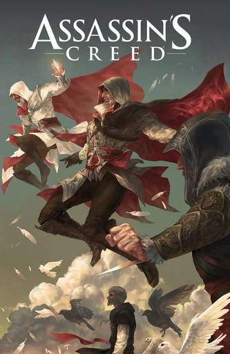
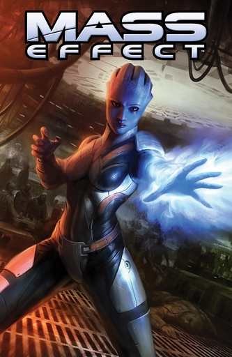
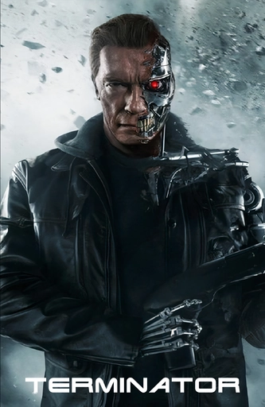
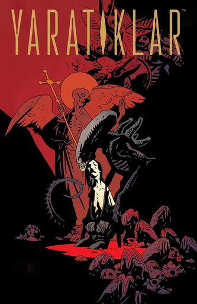

![[CB.webp]]

[Çizgi Bölgesi](https://www.cizgibolgesi.com/) ile ortaklaşa yaptığımız çizgi romanların sıralı listesine ve okuma bağlantılarına aşağıdan ulaşabilirsiniz.

<table class="cizgi"> <tbody> <tr> <td>  Başkaldırı (2020)  <a href="https://animusprojesi.com/assassins-creed-baskaldiri-001/">001</a> – <a href="https://animusprojesi.com/assassins-creed-baskaldiri-002/">002</a> – <a href="https://animusprojesi.com/assassins-creed-baskaldiri-003/">003</a> – <a href="https://animusprojesi.com/assassins-creed-baskaldiri-004/">004</a>  Shao Jun’un Kılıcı  <a href="https://animusprojesi.com/assassins-creed-shao-junun-kilici-001/">001</a> – <a href="https://animusprojesi.com/assassins-creed-shao-junun-kilici-002/">002</a> – <a href="https://animusprojesi.com/assassins-creed-shao-junun-kilici-003/">003</a> – <a href="https://animusprojesi.com/assassins-creed-shao-junun-kilici-004/">004</a> – <a href="https://animusprojesi.com/assassins-creed-shao-junun-kilici-005/">005</a> – <a href="https://animusprojesi.com/assassins-creed-shao-junun-kilici-006/">006</a> – <a href="https://animusprojesi.com/assassins-creed-shao-junun-kilici-007/">007</a> – <a href="https://animusprojesi.com/assassins-creed-shao-junun-kilici-008/">008</a>  Zafer Nidası (2021)  <a href="https://animusprojesi.com/assassins-creed-valhalla-zafer-nidasi-001-2021/">001</a> – <a href="https://animusprojesi.com/assassins-creed-valhalla-zafer-nidasi-002-2021/">002</a> – <a href="https://animusprojesi.com/assassins-creed-valhalla-zafer-nidasi-003-2021/">003</a> </td> <td>  Giriş (2020)  <a href="https://animusprojesi.com/marveldan-black-widow-giris-001-2020/">001</a> – <a href="https://animusprojesi.com/marveldan-black-widow-giris-002-2020/">002</a> </td><td>  Daredevil (2019)  <a href="https://animusprojesi.com/daredevil-001-2020/">001</a> – <a href="https://animusprojesi.com/daredevil-002-2020/">002</a> – <a href="https://animusprojesi.com/daredevil-003-2020/">003</a>  Korkusu Olmayan Adam (2020)  <a href="https://animusprojesi.com/korkusu-olmayan-adam-001-2020/">001</a> – <a href="https://animusprojesi.com/korkusu-olmayan-adam-002-2020/">002</a> – <a href="https://animusprojesi.com/korkusu-olmayan-adam-003-2020/">003</a> – <a href="https://animusprojesi.com/korkusu-olmayan-adam-004-2020/">004</a> – <a href="https://animusprojesi.com/korkusu-olmayan-adam-005-2020/">005</a> </td> </tr> <tr><td>  Dragon Age (2010)  <a href="https://www.cizgibolgesi.com/2022/06/dragon-age-01.html">001</a> – <a href="https://www.cizgibolgesi.com/2022/06/dragon-age-02.html">002</a> – <a href="https://www.cizgibolgesi.com/2022/06/dragon-age-03.html">003</a> – <a href="https://www.cizgibolgesi.com/2022/06/dragon-age-04.html">004</a> – <a href="https://www.cizgibolgesi.com/2022/06/dragon-age-05.html">005</a> – <a href="https://www.cizgibolgesi.com/2022/06/dragon-age-06.html">006</a> –  Sessizlik Korusu  <a href="https://animusprojesi.com/dragon-age-sessizlik-korusu-001/">001</a> – <a href="https://animusprojesi.com/dragon-age-sessizlik-korusu-002/">002</a> – <a href="https://animusprojesi.com/dragon-age-sessizlik-korusu-003/">003</a>  Üçkağıt (2020)  <a href="https://animusprojesi.com/dragon-age-uckagit-001/">001</a> – <a href="https://animusprojesi.com/dragon-age-uckagit-002/">002</a> – <a href="https://animusprojesi.com/dragon-age-uckagit-003/">003</a> </td><td>  Kefaret  <a href="https://animusprojesi.com/mass-effect-kefaret/">001</a> – <a href="https://animusprojesi.com/mass-effect-kefaret-002/">002</a> – <a href="https://animusprojesi.com/mass-effect-kefaret-003/">003</a> – <a href="https://animusprojesi.com/mass-effect-kefaret-004/">004</a>  <a href="https://animusprojesi.com/mass-effect-baskin-ve-sorusturma/">Baskın ve Soruşturma</a>  <a href="https://animusprojesi.com/mass-effect-blasto-sonsuzluk-ebedidir/">Blasto: Sonsuzluk Ebedidir</a>  <a href="https://animusprojesi.com/mass-effect-mahkumiyet/">Mahkûmiyet</a>  <a href="https://animusprojesi.com/mass-effect-son-gulen-iyi-guler/">Son Gülen İyi Güler</a> </td> <td>  Sıfırıncı Gün Açığı  <a href="https://animusprojesi.com/terminator-sifirinci-gun-acigi-birinci-bolum/">001</a> – <a href="https://animusprojesi.com/terminator-sifirinci-gun-acigi-ikinci-bolum/">002</a> </td> </tr> <tr><td>  Amerikan Rüyaları  <a href="https://animusprojesi.com/the-last-of-us-amerikan-ruyalari-001/">001</a> – <a href="https://animusprojesi.com/the-last-of-us-amerikan-ruyalari-002/">002</a> – <a href="https://animusprojesi.com/the-last-of-us-amerikan-ruyalari-003/">003</a> – <a href="https://animusprojesi.com/the-last-of-us-amerikan-ruyalari-004/">004</a> </td><td>  Tomb Raider (2014)  <a href="https://animusprojesi.com/tomb-raider-001/">001</a> – <a href="https://animusprojesi.com/tomb-raider-002/">002</a> – <a href="https://animusprojesi.com/tomb-raider-3/">003</a> – <a href="https://animusprojesi.com/tomb-raider-4/">004</a> – <a href="https://animusprojesi.com/tomb-raider-005/">005</a> – <a href="https://animusprojesi.com/tomb-raider-006/">006</a> – <a href="https://animusprojesi.com/tomb-raider-007/">007</a> – <a href="https://animusprojesi.com/tomb-raider-008/">008</a> – <a href="https://animusprojesi.com/tomb-raider-009/">009</a> – <a href="https://animusprojesi.com/tomb-raider-10/">010</a> – <a href="https://animusprojesi.com/tomb-raider-011/">011</a> – <a href="https://animusprojesi.com/tomb-raider-012/">012</a> </td><td>  Kurtuluş  <a href="https://www.cizgibolgesi.com/2022/06/yaratklar-kurtulus-01.html">01.1</a> – <a href="https://animusprojesi.com/yaratiklar-kurtulus-01-2/">01.2</a> </td> </tr> </tbody> </table>

## Aliens
Kurtuluş:

## Assassin's Creed

Başkaldırı (2020): 

Shao Jun’un Kılıcı:

Zafer Nidası (2021):

## Black Widow
Giriş: 

## Daredevil
Daredevil (2019): 

Korkusu Olmayan Adam (2020): 

## Dragon Age

Dragon Age (2010): 

Sessizlik Korusu: 

Üçkağıt (2020): 

## Mass Effect
Kefaret: 

Baskın ve Soruşturma

Blasto: Sonsuzluk Ebedidir

Mahkûmiyet

Son Gülen İyi Güler

## Terminator
Sıfırıncı Gün Açığı: 

## The Last of Us
Amerikan Rüyaları: 

## Tomb Raider
Tomb Raider (2014): 